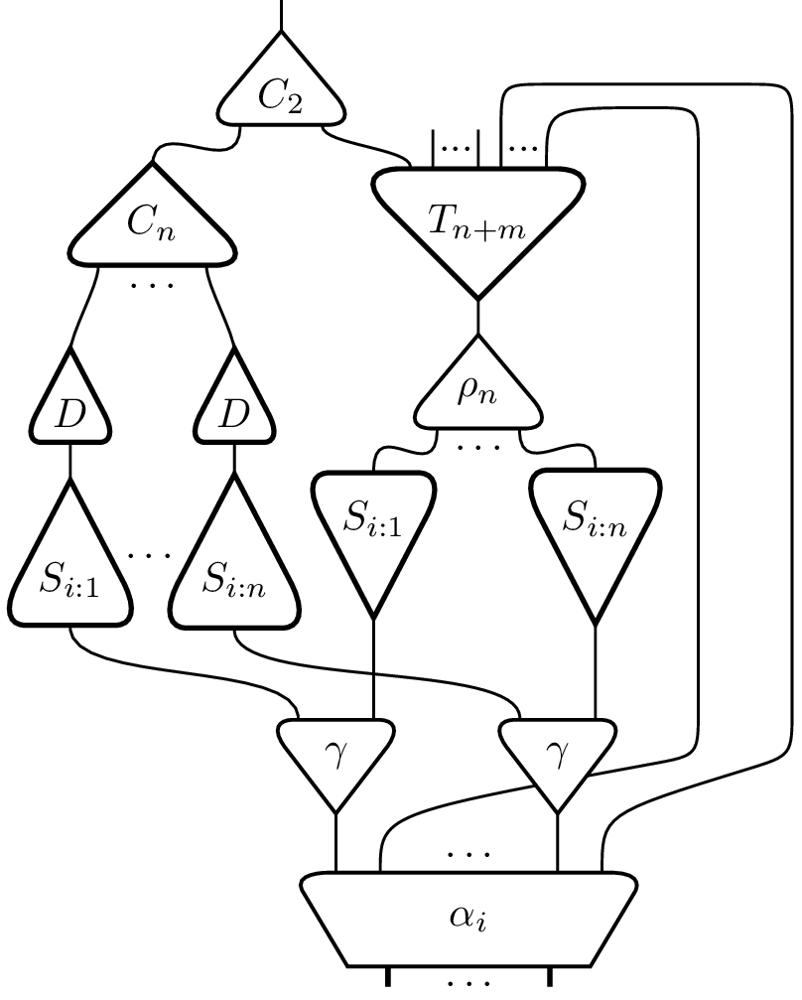

# tikz-multinets

A LaTeX package to draw the most general interaction nets: with multiports and multiwires (a.k.a. hyperedges)

### An example is worth a thousand codelines



The brute code to this example [here](./examples/LargeExample.tex)
For some explanation, see [below](#exampleCode).

### Lafont interaction nets.
Lafont interaction nets, presented first in <a name="cite1"/>[[1](#myfootnote1)],
are graphical computation languages in which the minimal step of computation
is given by rewriting rules on pairs of cells.
This way, a program, having a cell `a` but missing some cell `b` can interact with another program which has
`b`, thus modeling interaction.
Laffont kept things simple as he was modeling classical computations
providing the expressivity of [Turing machines](https://en.wikipedia.org/wiki/Turing_machine).

Since then, interaction nets evolved.
One of the evolutions was to bring in [concurrency](https://en.wikipedia.org/wiki/Concurrent_computing).

In order to do this, cells have been upgraded to *multicells*: cells with multiple ports,
and connection was allowed between mode than just two cells at once by the use of *multiwires*.
This package does exactly this: allows to draw *multicells* and *multiwires*.

At the end of the day, multinets are similar to hypergraphs.
With the addition of precise connection to vertices by the use of *ports*.

### A brief introduction to the use of the package

Each element of the net is defined separately as you would describe it orally: there are cells like this, others like that. A wire connets that port of that cell to this port of this cell, etc.

To create a cell, give it:
1. a _**name**_ in order to refer to it later
1. a _**label**_: it is the sign shown on the cell
   If the label is simple (no inline formula), you can skip the name: it will automatically be the same as the label
1. a _**number of principal ports**_ and of _**auxiliary ports**_
1. a _**position**_ (see below).
1. a _**direction**_: `U`, `D`, `R`, `L` for _Up_, _Down_, _Right_ and _Left_, or an angle in degrees with `0` for _Down_ and going clockwise

Following tikz conventions, you can define position in many ways:
- with cartesian coordinates: `{2,3}`
- with polar coordinates: `{50:2cm}`
- relative to another element: `{a_cell}+{2,3}`
- aligned with two existing elements  
 - horizontally to `a_cell`, vertically to `b_cell`: `{a_cell -| b_cell}`
 - vic-versa: `{a_cell |- b_cell}`
- between two elements at a given proportion:
`{$(a_cell)!.25!(b_cell)$}`
- some combinations of these:
`{$(a_cell)+(2,4)!.25!(b_cell)$}`

This package adds another type of positioning:
_**relative to a given port of a given cell**_.

`{gamma.pax 1}++{1.7}`

1.7 of whatever unit is used in the picture, above the first auxiliary port of cell `gamma`, where above means "in the direction in which the port points".

While cells are quite straightforward to define (not _easy_, _straightforward_),
wires require a little more attention.
The package does not contain automatic calculation of paths.
Nevertheless it uses the power of Tikz ... (wire, short wire or very short wire...)

### An explanation of the code that produces the nice example above

<a name="exampleCode">It's</a> possible to pre-define some cells to be used as a shortcut later.
Choose a latex command name, some tikz options, the number of ports:

```latex
\newcommand{\selector}
	{\inetmulticellshape[very thick,inner sep=0pt,isosceles triangle apex angle=55]{1}{3}}
\newcommand{\multiplexor}
	{\inetmulticellshape[very thick,inner sep=-3pt,isosceles triangle apex angle=90]{1}{3}}
\newcommand{\decoder}
	{\inetmulticellshape[very thick,inner sep=0pt,isosceles triangle apex angle=55]{1}{1}}
```

To use later in the code, just add a name, a label, a position and/or a direction:
```latex
  \selector(Si1){$S_{i:1}$}{0,0}[U]
```

If needed, you can add (or overwrite) tikz-style properties to an already predefined cell:
```latex
 \multiplexor[arity=7](multiplex){$T_{n+m}$}{0,0}
```

One can even predefine a cell with a given label:

```latex
 \newcommand{\gammacell}
	{\inetmulticelltype[isosceles triangle apex angle=75]{$\gamma$}{1}{2}}
```
Even easier to use: just add a name, a position (and/or direction):
```latex
 \gammacell(gamma){0,0}
```


```latex
\begin{tikzpicture}[show nodes=false]

 \inetmulticell[minimum width=15ex](alpha){$\alpha_i$}{3}{7}{0,0}
 \inetport(alpha.pal 1)
 \inetdotsabove(alpha.pal 2)
 \inetport(alpha.pal 3)
 \inetdotsabove(alpha.pax 4)
%
 \gammacell(gamma1){alpha.pax 7}++1
 \inetwire(gamma1.pal)(alpha.pax 7)
 \gammacell(gammaN){alpha.pax 2}++1
 \inetwire(gammaN.pal)(alpha.pax 2)
%
 \selector(Si1){$S_{i:1}$}{gamma1.pax 1}++{1.7}
 \inetwire(Si1.pal)(gamma1.pax 1)
%
 \selector(SiN){$S_{i:n}$}{gammaN.pax 1}++{1.7}
 \inetwire(SiN.pal)(gammaN.pax 1)
%
 \inetmulticell(rho){$\rho_n$}{3}{1}{0.08,4.5}
 \inetshortwire(rho.pal 1)(Si1.pax 2)
 \inetshortwire(rho.pal 3)(SiN.pax 2)
 \inetdotsabove(rho.pal 2)
%
 \multiplexor[arity=7](multiplex){$T_{n+m}$}{rho.pax 1}++{1}
 \inetwirecoords(multiplex.pal)(rho.pax 1)
 \inetwirefree(multiplex.pax 6)
 \inetabove(multiplex.pax 5){...}
 \inetwirefree(multiplex.pax 4)
 \inetabove(multiplex.pax 2){...}

 \inetnode(n1){gammaN}+{1.2,0}
 \inetnode(nN){n1.e}++{.8}
 \node at ($(n1)!.5!(nN)$){$\ldots$};

 \inetnode(m1){n1 |- multiplex.above above pax}
 \inetnode(mN){nN |-  multiplex.above above pax}+{0,.2}
 \node at ($(m1)!.5!(mN)$) {$\ldots$};
 %\inetnode(mN'){m1.n}+{-.5,.2}
 \inetnode(mN'){mN -| multiplex.pax 3}

 {\inetwiresunder
  \inetwire(alpha.pax 6)<n1.s><m1.n>(multiplex.pax 1);
  \inetwire(alpha.pax 1)<nN.s><mN.s><mN'>(multiplex.pax 3);

  \selector(Si1'){$S_{i:1}$}{-3.4,2.9}[U]
  \inetshortwire(Si1'.pax)(gamma1.pax 2)
  \selector(SiN'){$S_{i:n}$}{Si1'}+{1.4,0}[U]
  \inetshortwire(SiN'.pax)(gammaN.pax 2)
  \node at ($(Si1')!.5!(SiN') + (0,.2)$) (mid1) {\ldots};
 }
%
 \decoder(D1){$D$}{Si1'.pal}++{.6}[U]
 \inetwirefree(D1.pax)
 \decoder(DN){$D$}{SiN' |- D1}[U]
 \inetwirefree(DN.pax)
%
 \multiplexor[inner sep=1pt](multiplex'){$C_{n}$}%
					{mid1 |- multiplex}[U]
%
 \inetveryshortwire(D1.pal)(multiplex'.pax 1)
 \inetdotsabove(multiplex'.pax 2)
 \inetveryshortwire(DN.pal)(multiplex'.pax 3)
%
 \inetcell[shape border uses incircle=false](copy){$C_2$}%
					{$(multiplex'.pal)!.5!(multiplex.pax 7) + (0,.6)$}[U]

 \inetveryshortwire(multiplex.pax 7)(copy.right pax)
 \inetshortwire(multiplex'.pal)(copy.left pax)
%
 \inetwirefree(copy.pal)
\end{tikzpicture}
```


[^](#cite1) <a name="myfootnote1"/>[1]</a>: Lafont, Y. Interaction nets. *In Proceedings of the 17th ACM SIGPLAN-SIGACT
symposium on Principles of programming languages* (New York, NY, USA, 1990), POPL
'90, ACM, pp. 95-108.
